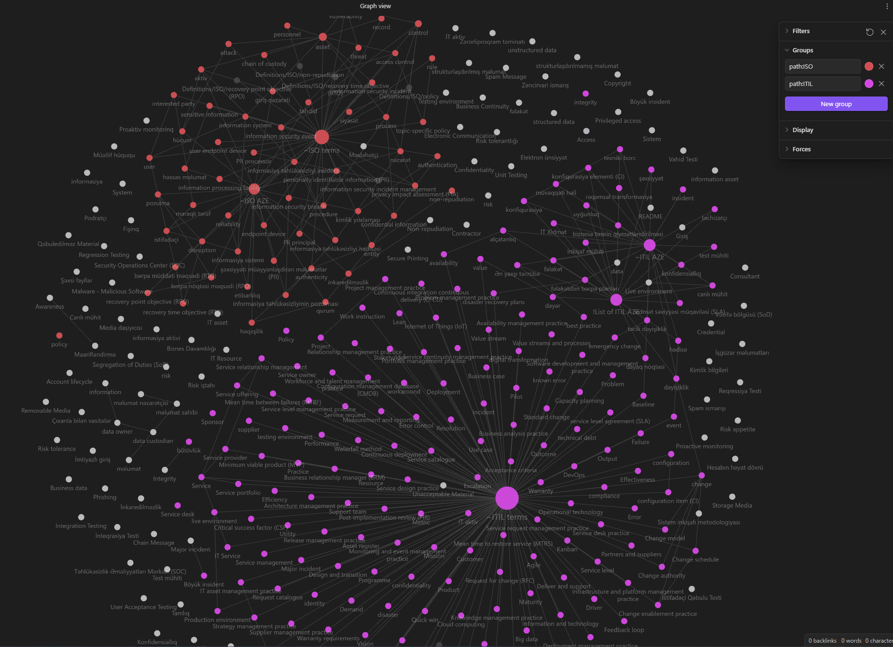

# definitions

The purpose of this repository is to collect commonly used terms and their description in the field of IT Governance and ITSM, and translate them into Azerbaijani.

Obsidian markdown format are used as note-taking and knowledge management tool.

- ISO folder contains definitions of terms mostly from the ISO 27001 version 2022 standard
- ISO AZE contains definitions of terms mentioned in ISO folder
- ITIL is definitions of terms (excluded terms already used in ISO folder) which I use in documents
- ITIL AZE contains definitions of terms mentioned in ITIL folder
- ENG folder contains definitions of terms which are not included in other folders
- AZE is a translation of terms located in the ENG section into the Azerbaijani language 

🌱 **Contributing to the Community**

We believe in the power of collaboration and knowledge-sharing. This repository thrives on contributions from enthusiasts like you! Contribute your insights, expand our glossary, or suggest improvements to keep the learning journey ever-evolving.

